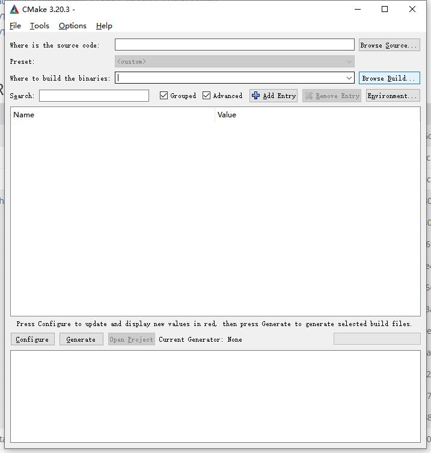
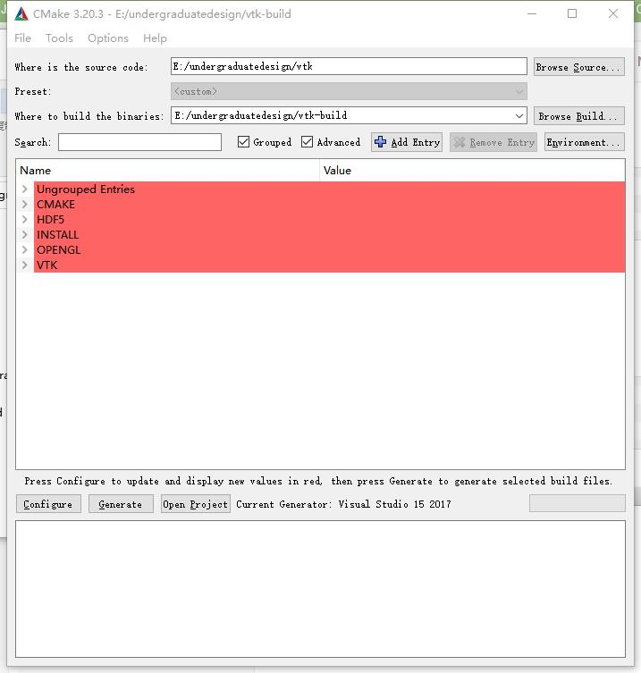
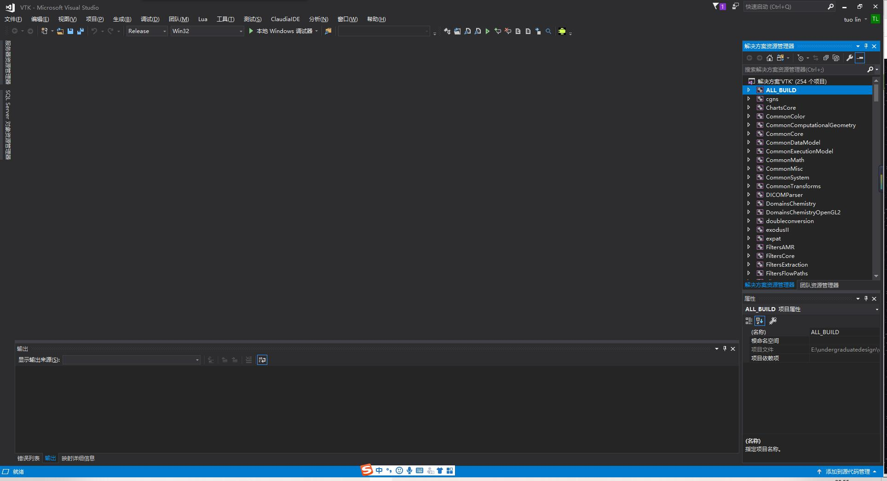

# 存档说明

该源文件需要使用CMake进行编译并同时拥有VTK库的支持

## 环境安装说明

### CMake安装

从[官网](https://cmake.org/)下载即可。如有兼容性问题，请先完全删除后重装

### VTK相关资源下载与库生成

- 资源下载

    从[官方](https://vtk.org/download/)地址下载所需的资源。由于此为c++版本，可以下载较老的资源（8.2）。新人若想重构可用python。也可以从git上进行clone

- 编译

    cmake安装完成后显示如下
    Source Code一栏选取目标编译文件所处目录（重要！需含CMakeList.txt）
    Build the Binaries一栏选取生成文件存放目录,生成后如下图在其中需要注意的是*BUILD_SHARED_LIBS*与*CMAKE_INSTALL_PREFIX*。前者决定是否生成动态链接库(*.dll)，后者决定何处生成文件。成功编译则可用自定的工具打开工程

- 安装

    打开的工程如图
    根据需要选择编译Debug还是Release，前期学习和开发的话，建议编译Debug版本，右键ALL_BUILD，点击生成

